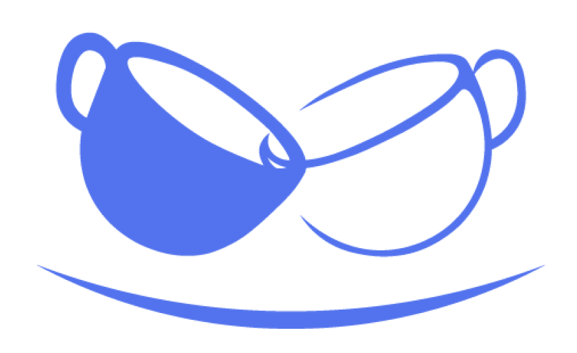

# ☕️ 커담 Keodam
> 대학생을 위한 새로운 네트워킹 문화, **커피챗 플랫폼 커담**
 
 

## 🌱 커담이란?
커담(Keodam)은 대학생들이 **가볍지만 의미 있는 대화(커피챗)** 를 통해  
진로, 전공, 학교 생활에 관한 **실질적이고 신뢰할 수 있는 경험**을 나눌 수 있도록 만든 서비스입니다.  
 
 
## 💡 왜 커담인가?
- 대학 생활은 짧고, 기회는 많지 않습니다.  
- 하지만 **혼자 고민하고 찾아보기엔 한계**가 있고, SNS나 커뮤니티는 **정보 신뢰도가 낮습니다.**  
- 커담은 대학생이 **선배, 동료, 다른 전공자**와 부담 없이 대화하며 **현실적인 팁과 노하우**를 얻을 수 있게 돕습니다.  
 
 

---
 
 

 
  대학생들의 작은 고민부터,  
  미래 진로, 취업까지 커담이 도와드려요! 

 
 

## 🚀 주요 기능 (Features)

- 💬 대면 커피챗 중계 및 매칭 시스템
- 🔍 커뮤니티 및 아티클 게시, 댓글/좋아요/링크 공유
- ⭐️ 리뷰 기반 신뢰도 시스템 (최신순 정렬 + 별점)
- 💰 추천인 & 미션 이벤트 기반 원두(포인트) 보상
 
 

## 👥 이런 분들께 추천해요 !

- 🤔 **진로·취업 고민이 있는 대학생**  
  → 선배 경험을 빠르게 듣고, 방향성을 찾고 싶은 분  

- 👫 **새로운 사람들과 네트워킹을 원하는 분**  
  → 편하게 대화하면서 관계를 넓히고 싶은 분  

- 📝 **실제 경험 기반의 정보를 찾는 분**  
  → 인터넷 검색이 아닌, 생생한 조언을 얻고 싶은 분  

- 🎯 **성장과 자기계발에 관심 있는 분**  
  → 다양한 대화 속에서 동기부여와 인사이트를 얻고 싶은 분
 
 

---

👉 [커담 홈페이지 바로가기](https://keodam.com)

  

 
MIT © Keodam Team
